# Microsoft-Cloud-Adoption-Framework-for-Azure #

## Table of content ##

1. Prerequisite
2. Hub-Spoke Reference Architecture
3. Implement Hub-Spoke Reference Architecture with Azure Blueprint

## Prerequisite ##

### Azure subscription ###
A Azure subscription is required. If your organization already using Azure, please sign up a new Azure account with your personal email and use [Azure Pass](https://www.microsoftazurepass.com/) to redeem Azure Credit.

### Scripts for creating Azure Resources ###
Please down the file ***src*** in this repo to get the scripts for creating Azure Resources later in this tutorial

## Hub-Spoke Reference Architecture ##
This reference architecture shows how to implement a hub-spoke topology in Azure. The hub is a virtual network (VNet) in Azure that acts as a central point of connectivity to your on-premises network. The spokes are VNets that peer with the hub, and can be used to isolate workloads. Traffic flows between the on-premises datacenter and the hub through an ExpressRoute or VPN gateway connection.
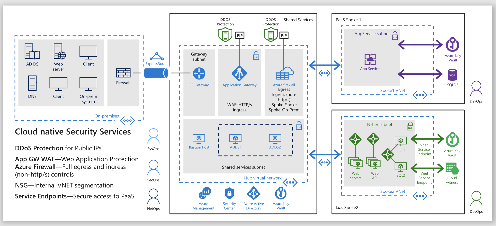

## Implement Hub-Spoke Reference Architecture with Azure Blueprint ##

### Create Blueprint ###
1. Go to Azure Portal, search ***Azure Active Directory***
2. Click ***Create a blueprint***
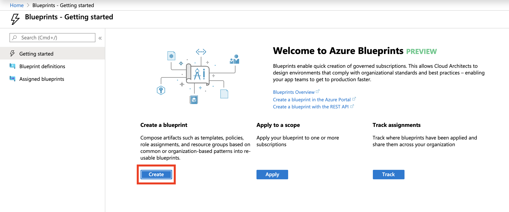
3. Select ***CAF Foundation*** as blueprint sample
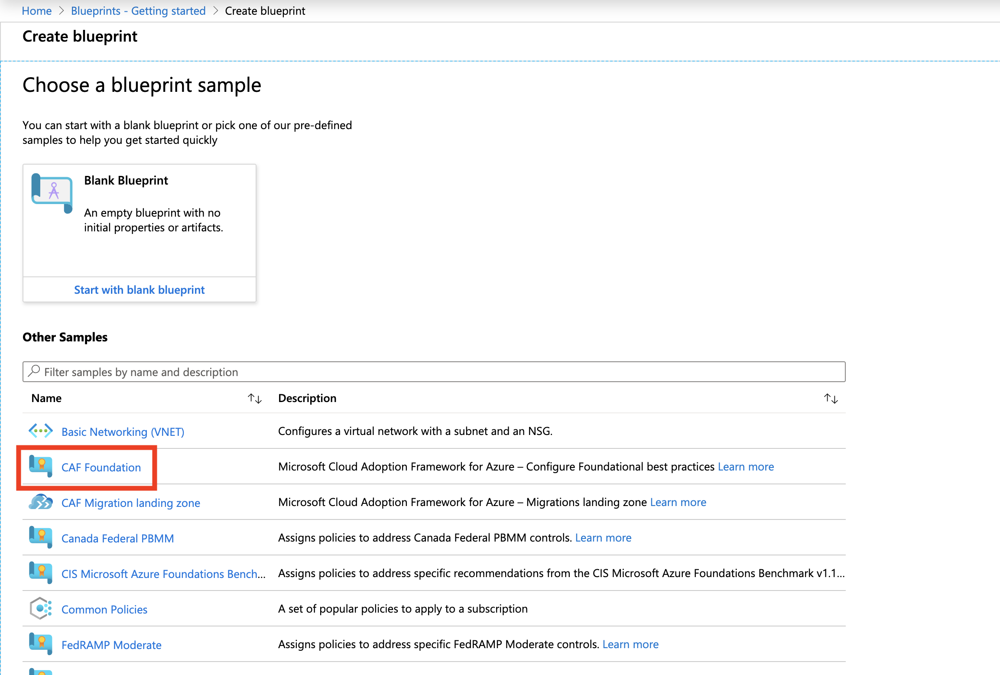
4. Fill in the information and click ***Next : Artifacts***
    |Property  |Description  |
    |---------|---------|
    |**Blueprint name** | The name of your blueprint |
    |**Blueprint description** | Description of your blueprint |
    |**Definition location** | Provide subscription where the blueprint definition is saved |
5. Delete some artifacts
    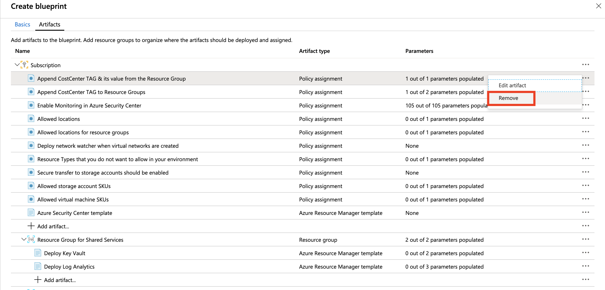
    |Artifacts  |
    |---------|
    |**Append CostCenter TAG & its value from the Resource Group** |
    |**Append CostCenter TAG to Resource Groups** |
    |**Deploy Key Vault** |
    |**Resource Group for Identity Services** |
    |**Resource Group for First Application** |
6. Under ***Subscription***, click ***Add artifact...***, and create three recource groups
    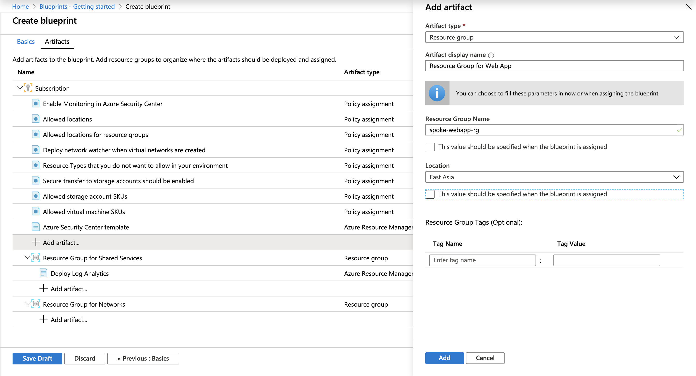
    |Artifact display name  |Resource Group Name (Uncheck the box) |Location (Uncheck the box)  |
    |---------|---------|---------|
    |**Resource Group for Web App** |**spoke-webapp-rg**  |**East Asia**  |
    |**Resource Group for Core Service** |**[concat(parameters('Organization_Name'),'-Core-rg')]**  |**East Asia**   |
    |**Resource Group for JumpBox** |**[concat(parameters('Organization_Name'),'-JB-rg')]**  |**East Asia**   |
7. Under ***Resource Group for Networks***, click ***Add artifact...***, and create a Azure Resource Manager template
    |Property |Action |
    |---------|---------|
    |**Artifact type** |**Azure Resource Manager template**  |
    |**Artifact display name** |**Deploy Recovery Service Vault**  |
    |**Description** | |
    |**Template** |**import file: createRecoveryServiceVault.json**  |
    |**Parameters** |**vaultName: recovery-service-vault, changeStorageType: false, valutStorageType: GloballyRedundant, location: [resourceGroup().location]**  |
    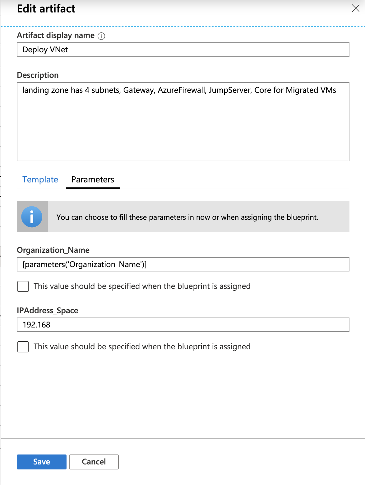
8. Under ***Resource Group for Shared Services***, click ***Add artifact...***, and create a Azure Resource Manager template
    |Property |Action |
    |---------|---------|
    |**Artifact type** |**Azure Resource Manager template**  |
    |**Artifact display name** |**Deploy VNet**  |
    |**Description** |**landing zone has 4 subnets, Gateway, AzureFirewall, JumpServer, Core for Migrated VMs** |
    |**Template** |**import file: createVNet.json**  |
    |**Parameters** |**Organization_Name: [parameters('Organization_Name')], IPAddress_Space: 192.168**|
    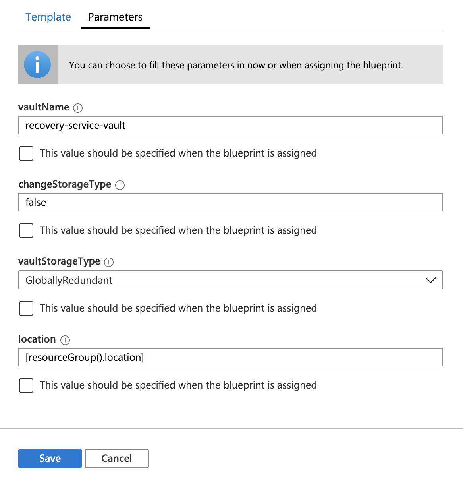
9. Under ***Resource Group for Web App***, click ***Add artifact...***, and create a Azure Resource Manager template
    |Property |Action |
    |---------|---------|
    |**Artifact type** |**Azure Resource Manager template**  |
    |**Artifact display name** |**Deploy WebApp**  |
    |**Description** | |
    |**Template** |**import file: createWebApp.json**  |
    |**Parameters** |**webAppName: webAppName, sku: F1, linuxFxVersion:php|7.0, location: [resourceGroup().location]**|
    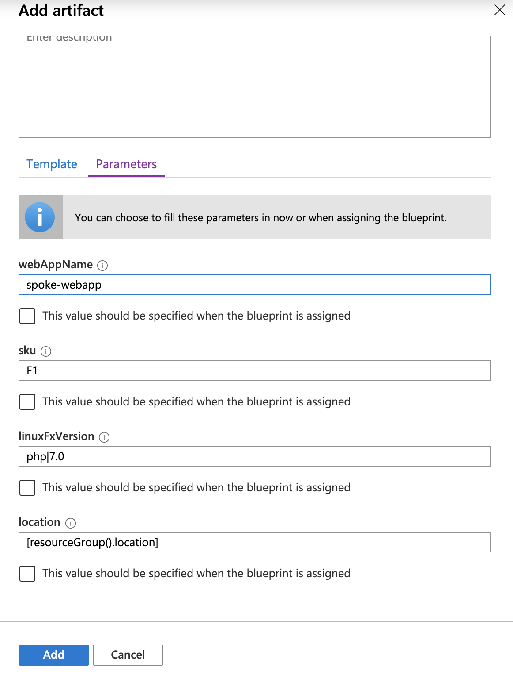
10. Click ***Save Draft***
    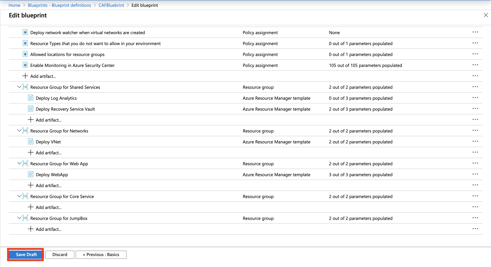
11. Go to ***Blueprint definitions***, click ***Publish blueprint*** for your saved draft blueprint
    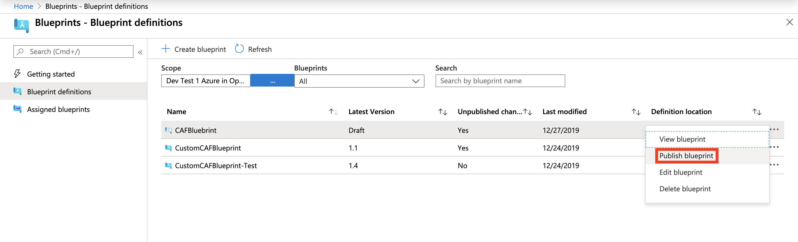
12. Name Version as **1.0**, and click ***Publish***
    
13. Click ***Assign blueprint***, fill in the following information:
    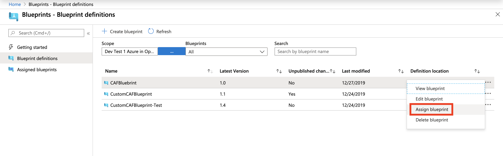
    |Property |Action |
    |---------|---------|
    |**Assignment name** |**Assignment-CAFBluebrint**  |
    |**Location** |**East Asia**  |
    |**Blueprint definition version** |**1.0** |
    |**Lock Assignment** |**Don't Lock**  |
    |**Enter your organization name** |**(You may add your organization name here)**|
    |**Select the Azure Region to deploy the Resources** |**East Asia**|
    |**Which Azure Region will you allow Resources to be built in?** |**Select All**|
    |**Storage Account SKUs you want to ALLOW** |**Leave default value**|
    |**Virtual Machine SKUs you want to ALLOW** |**Leave default value**|
    |**Select the Azure Resource Types that you will DENY** |**Leave default value**|
    |**Number of days data will be retained in Log Analytics** |**Leave default value**|
    |**Azure Region used when establishing the Log Analytics workspace** |**Southeast Asia**|
    |**vaultName (Deploy Recovery Service Vault)** |**recovery-service-vault**|
    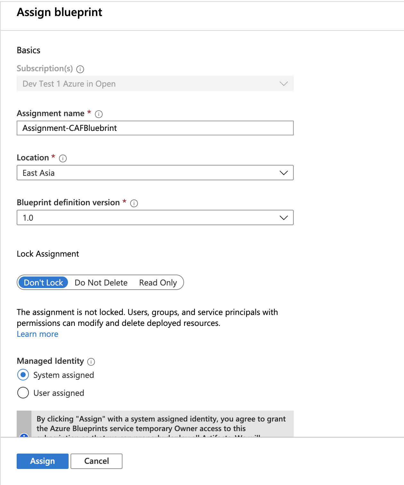
    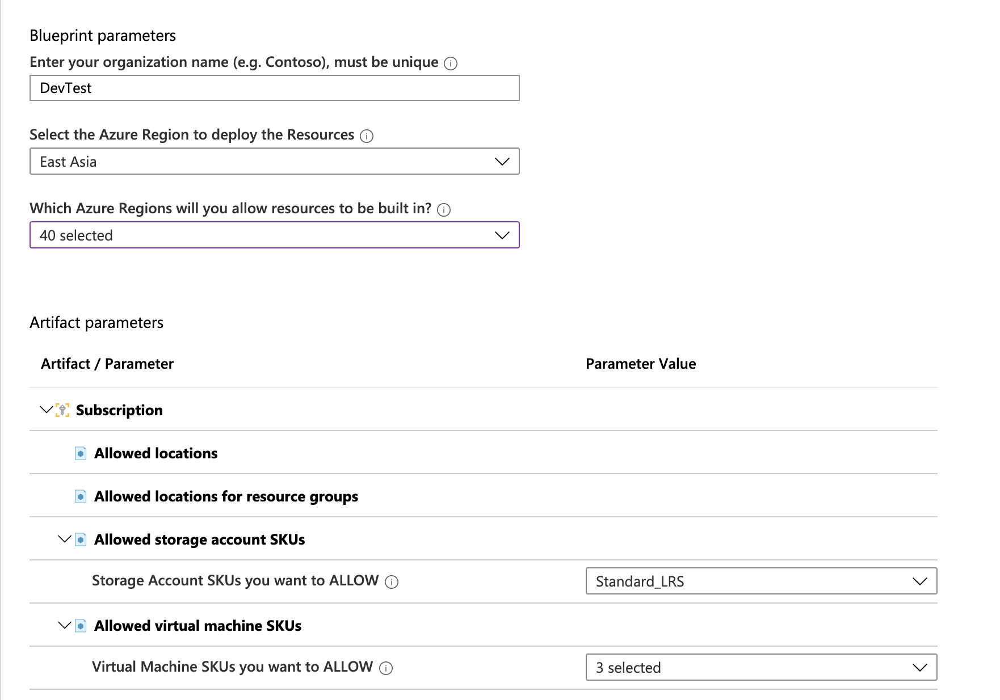
    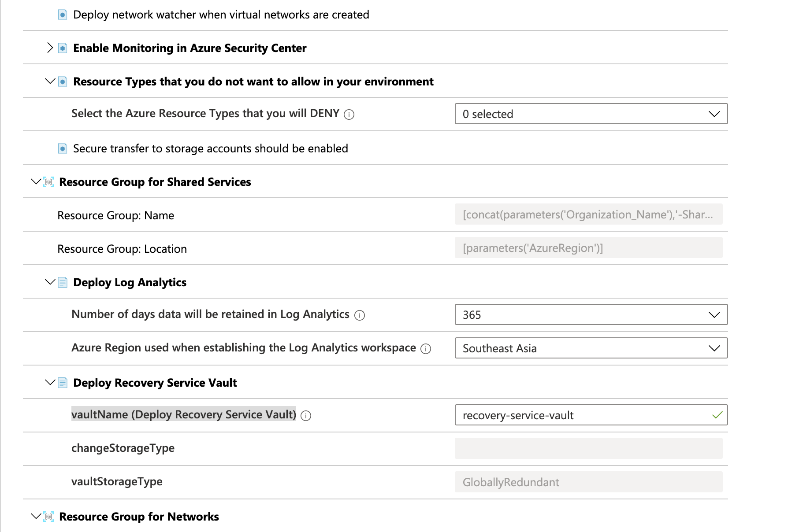
    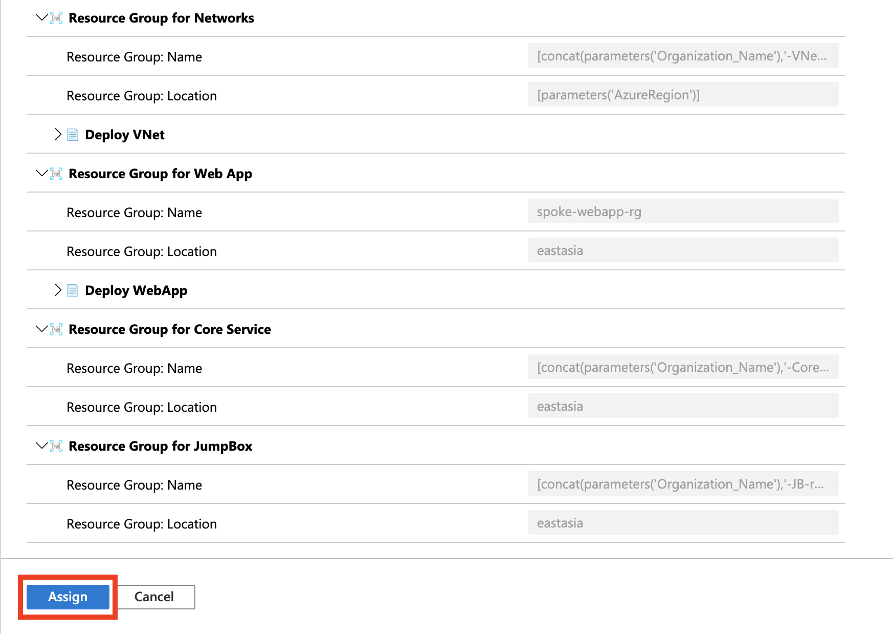
    Click ***Assign***

